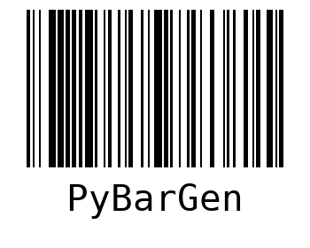

# About

<br>
An API that generates a PNG barcode based on a provided product code

# Techs
* Python
* Flask
* Barcode
* Cerberus
* PyTest
* Venv
* PyLint
* PreCommit

# Commands
* Activate venv
`source .venv/bin/activate`

* Verify venv
`which python`

* Update requirements:
`.venv/bin/pip3 freeze > requirements.txt`

* Run project
`python3 run.py`

* Run tests
`pytest -s -v`

# Endpoints
```bash
curl -X POST \
  -H "Content-Type: application/json" \
  -d '{"product_code": "123-456-789"}' \
  http://localhost:3000/create-tag
```
